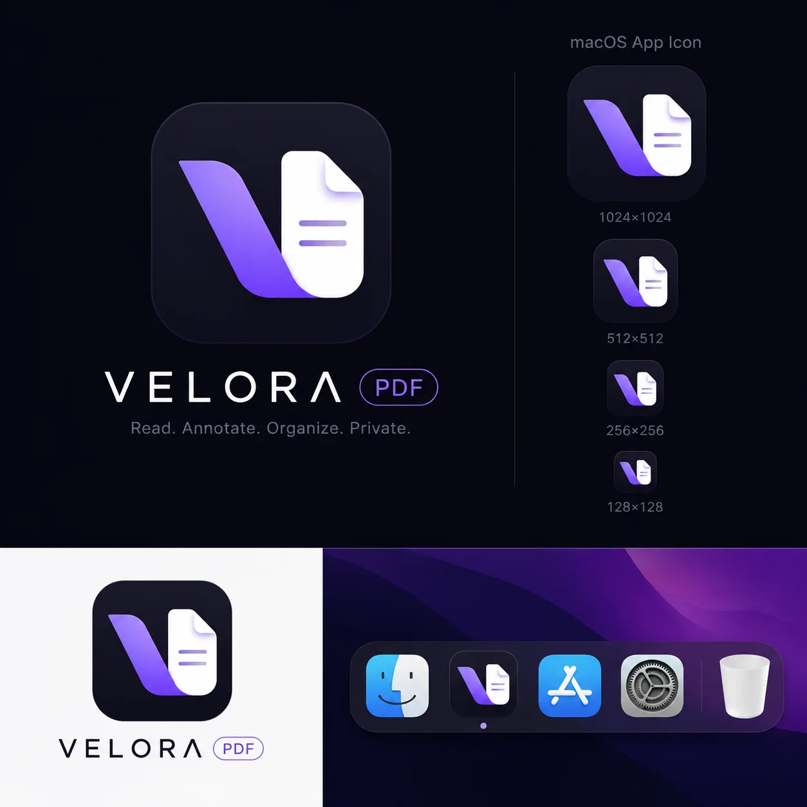
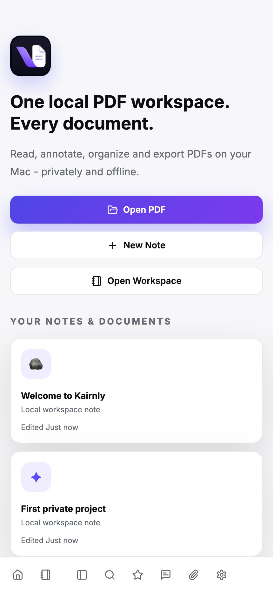
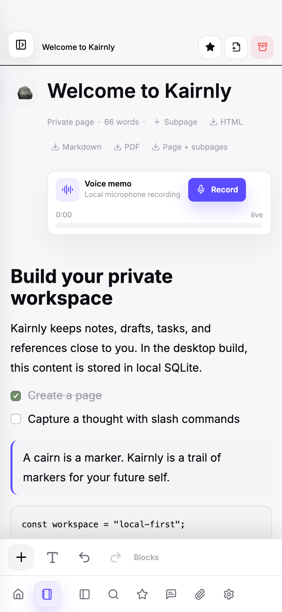
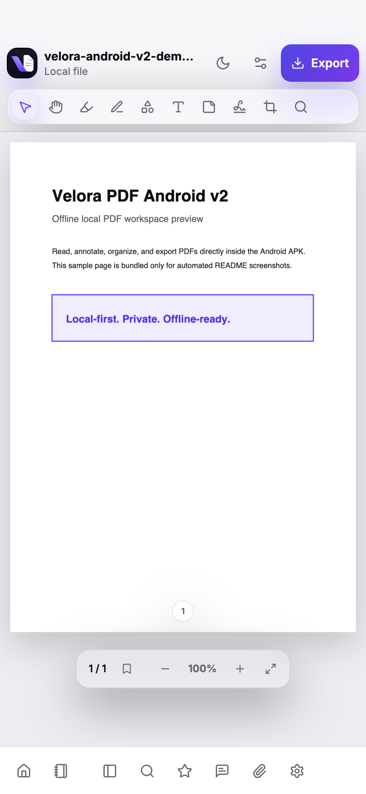
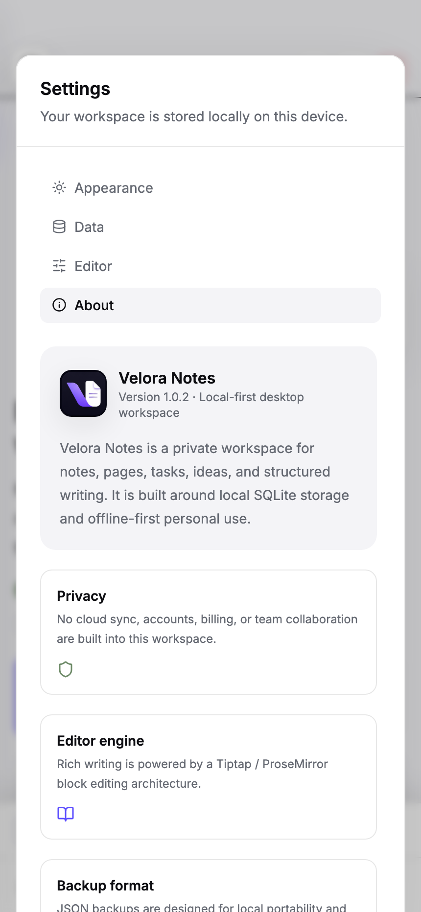
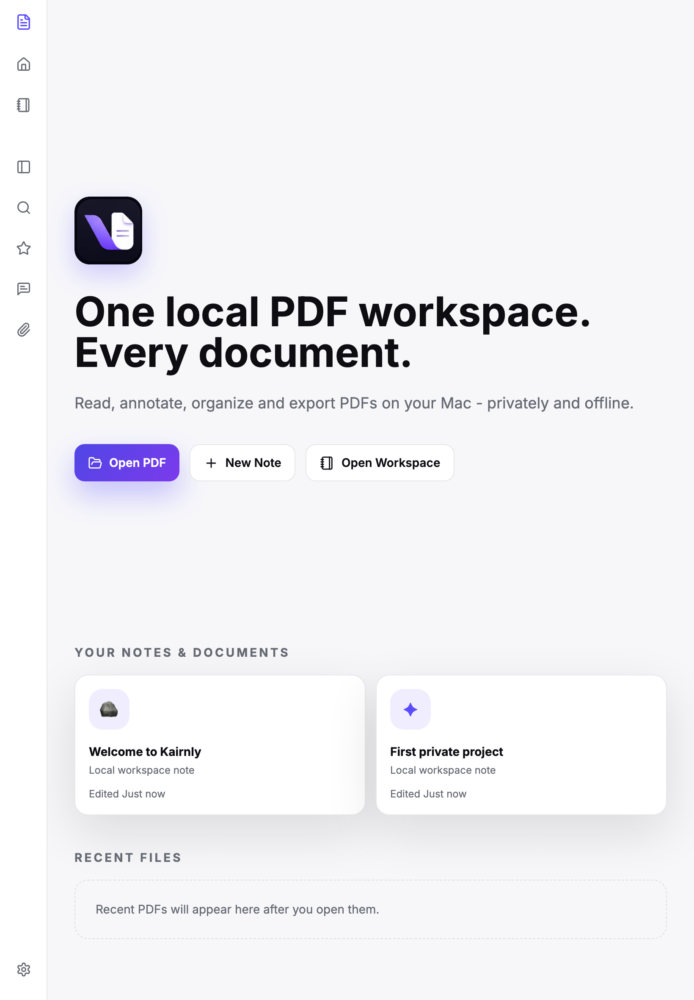
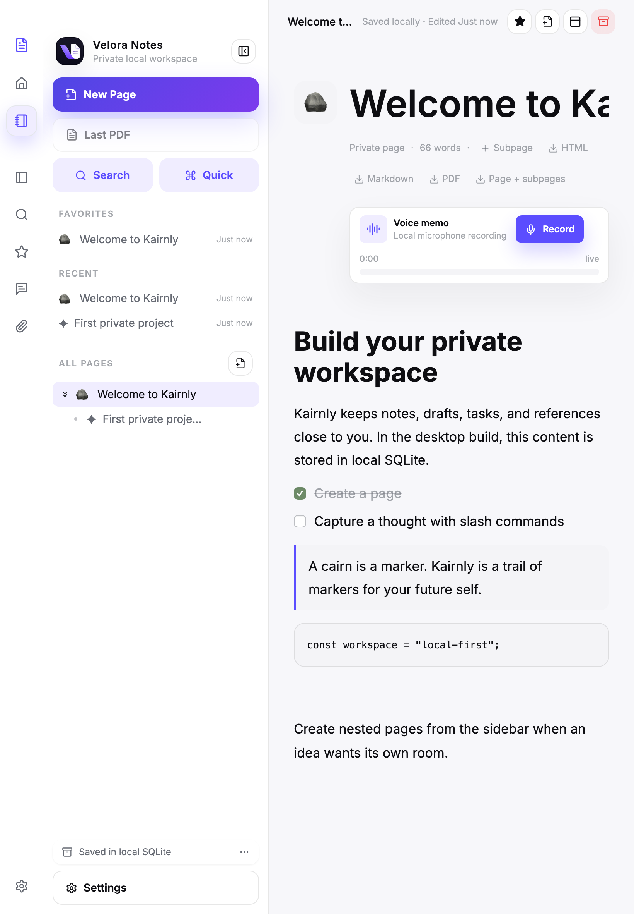
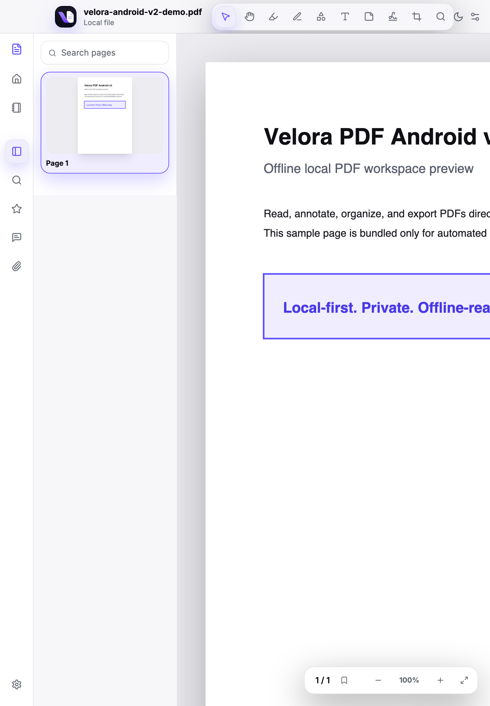
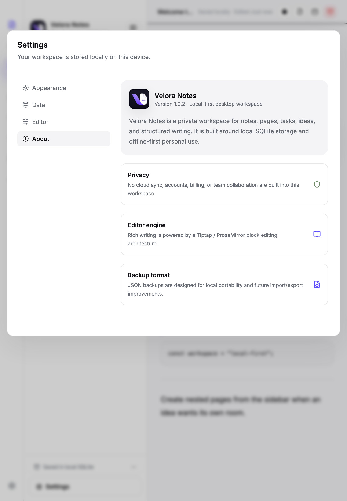

# Velora PDF

<p align="center">
  <strong>Private, local-first PDF reading and annotation for macOS, Windows, Android phones, and tablets.</strong>
</p>

<p align="center">
  <a href="https://veloraproject.app/">
    
  </a>
  <a href="downloads/Velora-PDF-1.0.47-aarch64.dmg">
    
  </a>
  <a href="downloads/Velora-PDF-1.0.51-x64-setup.exe">
    
  </a>
  <a href="downloads/Velora-PDF-Android-v2.1.16-arm64-v8a.apk">
    
  </a>
</p>

<p align="center">
  
  
</p>

[](https://buymeacoffee.com/mutlukurt)



[Download Velora PDF for macOS](downloads/Velora-PDF-1.0.47-aarch64.dmg)

[Download Velora PDF for Windows (x64 EXE)](downloads/Velora-PDF-1.0.51-x64-setup.exe)

[Download Velora PDF Android WebView APK v2.1.16 for arm64-v8a](downloads/Velora-PDF-Android-v2.1.16-arm64-v8a.apk)

Velora PDF is a private, local-first PDF reader, annotation workspace, and handwritten notebook app for macOS, Windows plus an offline Android WebView APK.

It is designed for people who want a calm, premium reading and note-taking experience without accounts, subscriptions, cloud sync, tracking, analytics, or external APIs. PDFs and notebooks stay on the user’s own device, render locally, annotate locally, record local voice memos, and export locally.

## Download macOS DMG

Download for macOS: [Velora-PDF-1.0.47-aarch64.dmg](downloads/Velora-PDF-1.0.47-aarch64.dmg)

Current local build output:

```text
/Users/mutlu/Desktop/Velora PDF_1.0.47_aarch64.dmg
```

Tauri build output:

```text
src-tauri/target/release/bundle/dmg/Velora PDF_1.0.47_aarch64.dmg
```

## Download Windows EXE

Download for Windows: [Velora-PDF-1.0.51-x64-setup.exe](downloads/Velora-PDF-1.0.51-x64-setup.exe)

This Windows build reveals the window the instant the boot shell paints, before the React bundle finishes downloading, so launch feels immediate instead of waiting on the full app to mount. An inline script emits a `velora-ready` signal as soon as the splash is painted and the Rust layer shows the window right away, with a guaranteed fallback. The React runtime chunk was also trimmed from ~965 KB to ~143 KB. It keeps the code-split bundle, on-demand PDF/editor/export libraries, and the single-transaction backup import from the previous releases.

Current local build output:

```text
C:\Users\mutlu\Desktop\Velora-PDF-1.0.51-x64-setup.exe
```

Tauri build output:

```text
src-tauri/target/release/bundle/nsis/Velora PDF_1.0.51_x64-setup.exe
```

## Download Android WebView APK v2.1.16

Velora PDF Android WebView APK v2.1.16 is a real native Android APK wrapper around the same web experience used by the root VeloraPDF app. It is not a PWA. The Vite production build is embedded inside the APK and served through Android `WebViewAssetLoader`, so the app runs offline and does not request the Android `INTERNET` permission.

Current Android WebView APK v2.1.16 downloads:

| Device / CPU | APK |
| --- | --- |
| Most modern phones and tablets, 64-bit ARM | [Velora-PDF-Android-v2.1.16-arm64-v8a.apk](downloads/Velora-PDF-Android-v2.1.16-arm64-v8a.apk) |
| Older 32-bit ARM phones and tablets | [Velora-PDF-Android-v2.1.16-armeabi-v7a.apk](downloads/Velora-PDF-Android-v2.1.16-armeabi-v7a.apk) |
| Android emulator / 32-bit x86 | [Velora-PDF-Android-v2.1.16-x86.apk](downloads/Velora-PDF-Android-v2.1.16-x86.apk) |
| Android emulator / 64-bit x86 | [Velora-PDF-Android-v2.1.16-x86_64.apk](downloads/Velora-PDF-Android-v2.1.16-x86_64.apk) |

For a normal Android phone, use `arm64-v8a`.

Current Android WebView APK v2.1.16 release build outputs:

```text
/Users/mutlu/Desktop/Velora-PDF-Android-APK-v2.1.16/Velora-PDF-Android-v2.1.16-armeabi-v7a.apk
/Users/mutlu/Desktop/Velora-PDF-Android-APK-v2.1.16/Velora-PDF-Android-v2.1.16-arm64-v8a.apk
/Users/mutlu/Desktop/Velora-PDF-Android-APK-v2.1.16/Velora-PDF-Android-v2.1.16-x86.apk
/Users/mutlu/Desktop/Velora-PDF-Android-APK-v2.1.16/Velora-PDF-Android-v2.1.16-x86_64.apk
```

Android WebView APK project source:

```text
VeloraPDF Android APK v2/
```

Android WebView APK v2.1.16 includes:

- The root VeloraPDF mobile web UI embedded directly inside the APK.
- Offline startup and app usage without the Android `INTERNET` permission.
- Local bundled fonts and Velora icon assets so home, sidebar, and settings artwork render correctly offline.
- Android-native microphone recording bridge for voice memos.
- Android-native Downloads bridge for Settings exports and generated archives.
- PDF, HTML, and Markdown exports preserve pasted line breaks; PDF export uses stable rendered list markers.
- Settings theme controls sync across PDF, Notes, and Notebook views.
- PDF Search, Thumbnails, Bookmarks, Comments, and Attachments panels include fully wired action states.
- Notes block controls use the same bottom action bar on desktop, browser, tablet, and phone instead of hover-only floating controls.
- Notes bottom action pill scrolls horizontally on narrow phones and tablets so every editor action remains reachable without viewport overflow.
- Drag-and-drop photo import works inside Notes pages and handwritten Notebook pages, with mouse and touch corner resizing.
- Window-level image drops land directly in the active Notes editor on browser and desktop builds.
- Selected images can be deleted from the bottom action bar or by right-clicking the image.
- Block insert and selected-image action panels open above the bottom pill on browser, DMG, tablet, phone, and Android WebView builds.
- Clicking a Notes image exposes move up, move down, and delete controls in the same bottom-pill panel system.
- Android-specific top spacing for the Notes workspace and PDF editor so status bar/camera areas do not cover controls.
- Phone-specific notebook responsive tuning so headers, controls, and handwritten pages fit narrow Android screens without horizontal document overflow.
- Taller phone writing pages for more comfortable stylus handwriting.
- Smoother Android PDF editor gestures with native WebView momentum scrolling, two-finger pinch zoom, and crisp canvas re-rendering after zoom.
- Hardware-accelerated WebView PDF rendering for clearer page movement on phones and tablets.
- Mobile settings modal scrolling and positioning tuned for Android screens.
- ABI-specific release APKs for `armeabi-v7a`, `arm64-v8a`, `x86`, and `x86_64`.

## Android WebView APK Screenshots

These screenshots show the offline Android WebView APK using phone and tablet viewport captures of the embedded web experience.

### Phone

| Home | Notes workspace |
| --- | --- |
|  |  |

| PDF editor | Settings |
| --- | --- |
|  |  |

### Tablet

| Home | Notes workspace |
| --- | --- |
|  |  |

| PDF editor | Settings |
| --- | --- |
|  |  |

## Important

### macOS Security Warning

This build is unsigned and distributed outside the Apple App Store without an Apple Developer ID certificate. Because of that, macOS Gatekeeper may block the app or show a warning such as:

```text
“Velora PDF” cannot be opened because the developer cannot be verified.
```

or:

```text
“Velora PDF” is damaged and cannot be opened.
```

The DMG generated by this project is physically valid. The warning is caused by Apple’s quarantine and signing checks for unsigned local builds.

To open it on your Mac:

1. Open the DMG.
2. Drag `Velora PDF.app` into the Applications folder.
3. Open Terminal and run:

```bash
xattr -cr "/Applications/Velora PDF.app"
```

4. Launch Velora PDF from Applications.

Alternatively, right-click or Control-click the app in Finder, choose `Open`, then confirm `Open` again.

## What Velora PDF Does

In plain language:

Velora PDF is a personal PDF reader and annotation app. You can open a local PDF, read it in a clean macOS-style workspace, zoom in and out, navigate pages, inspect thumbnails, search text, draw highlights and pen marks, save annotations as a JSON sidecar, and export a best-effort annotated PDF.

For users, this means:

- Open PDF files from your Mac.
- Read documents in a polished dark or light workspace.
- Navigate pages with thumbnails and page controls.
- Zoom in, zoom out, and return to fit-width scale.
- Search document text and jump to matching pages.
- Add highlight and pen annotations.
- Add rectangle, circle, arrow, text, and sticky-note annotations.
- Save annotation data as a local `.json` sidecar.
- Export an annotated copy of the PDF.
- Keep recent files on the device.
- Work fully offline.

For developers, this means:

- Tauri 2 desktop shell.
- React and Vite frontend.
- TypeScript strict mode.
- Tailwind CSS with CSS variables for theming.
- Zustand stores for PDF, UI, and annotation state.
- PDF.js rendering through `pdfjs-dist`.
- `pdf-lib` best-effort PDF export.
- Tauri dialog and filesystem plugins for native file open/save.
- Browser fallback for development preview mode.

## Product Philosophy

Velora PDF is built around a simple idea: PDF reading should feel fast, private, and elegant.

The interface aims to feel:

- Premium
- Calm
- Local-first
- Fast
- Focused
- Desktop-native
- Minimal but capable
- Private by default

Velora PDF is not a cloud SaaS app. It intentionally does not include login, billing, subscriptions, team workspaces, analytics, remote databases, or cloud document storage.

## Tech Stack

Core:

- Tauri 2
- React 18
- TypeScript
- Vite
- Tailwind CSS
- Zustand
- PDF.js via `pdfjs-dist`
- `pdf-lib`

Desktop integration:

- `@tauri-apps/api`
- `@tauri-apps/plugin-dialog`
- `@tauri-apps/plugin-fs`
- Rust Tauri shell
- macOS DMG bundle target
- Windows NSIS bundle target

Android APK v2 integration:

- Native Android application module.
- Android WebView with `androidx.webkit`.
- `WebViewAssetLoader` serving embedded Vite assets from APK storage.
- Android JavaScript bridge for native microphone recording.
- ABI split APK release outputs for 32-bit and 64-bit Android targets.
- No Android `INTERNET` permission.

UI and interaction:

- Lucide React icons
- Framer Motion for lightweight panel transitions
- CSS variables for light and dark themes
- Custom reusable UI primitives

Build tooling:

- Tauri CLI
- Vite
- TypeScript
- PostCSS
- Autoprefixer

## Architecture Overview

Velora PDF has three main layers.

### 1. Desktop Shell

The desktop shell lives in `src-tauri/`.

It provides:

- Native macOS desktop window through Tauri.
- Application metadata and bundle configuration.
- macOS DMG build target.
- App icon and platform icon assets.
- Tauri permissions for dialog and local filesystem access.
- Dialog and filesystem plugins.

Important files:

- `src-tauri/src/lib.rs`
- `src-tauri/src/main.rs`
- `src-tauri/tauri.conf.json`
- `src-tauri/capabilities/default.json`
- `src-tauri/icons/*`

### 2. Frontend App

The frontend lives in `src/`.

It provides:

- Premium app shell.
- Home screen.
- Top toolbar.
- Left vertical rail.
- Thumbnail and search side panels.
- PDF workspace.
- Right inspector panel.
- Dark/light theme system.
- Eye protection mode.
- Annotation UI and overlay interactions.

Important files:

- `src/app/App.tsx`
- `src/components/layout/AppShell.tsx`
- `src/components/layout/TopToolbar.tsx`
- `src/components/layout/LeftRail.tsx`
- `src/components/layout/RightInspector.tsx`
- `src/components/home/HomeScreen.tsx`
- `src/components/pdf/PdfViewer.tsx`
- `src/components/pdf/PdfPage.tsx`
- `src/components/pdf/AnnotationLayer.tsx`

### 3. Local PDF and Annotation Layer

The PDF and local file logic lives in `src/lib/` and `src/stores/`.

It provides:

- PDF file selection.
- Native Tauri read/write operations.
- Browser fallback for Vite preview.
- PDF.js document loading.
- PDF text search.
- Annotation state management.
- JSON sidecar save.
- Best-effort annotated PDF export with `pdf-lib`.
- Recent files stored locally.

Important files:

- `src/lib/tauri/fileDialog.ts`
- `src/lib/pdf/loadPdf.ts`
- `src/lib/pdf/searchPdf.ts`
- `src/lib/pdf/exportPdf.ts`
- `src/stores/usePdfStore.ts`
- `src/stores/useAnnotationStore.ts`
- `src/stores/useUiStore.ts`

## Main Features

### Local-First PDF Reader

- Opens local PDF files.
- Uses PDF.js for rendering.
- Does not upload files anywhere.
- Does not require an account.
- Does not call external APIs.
- Works offline.

### Premium Desktop Workspace

- macOS-style app window.
- Dark and light themes.
- Soft PDF canvas background.
- Floating tool controls.
- Left vertical icon rail.
- Right inspector panel.
- Recent files home screen.
- Custom Velora PDF app icon.

### PDF Navigation

- Page rendering.
- Page indicator.
- Previous and next page navigation.
- Scroll-based current page tracking.
- Zoom in and zoom out.
- Fit-width reset.
- Thumbnail panel.
- Click thumbnail to jump to page.

### Search

- Search panel.
- Text extraction through PDF.js text content.
- Page-based result list.
- Click search result to jump to page.

### Annotation MVP

Velora PDF includes a real annotation overlay layer. Annotations are stored in local React/Zustand state and can be saved as a JSON sidecar.

Supported annotation types:

- Highlight
- Freehand pen
- Rectangle
- Circle
- Arrow
- Text note
- Sticky note

Annotation interactions:

- Drag to create highlights.
- Draw freehand pen strokes.
- Draw shapes.
- Add text notes.
- Add sticky notes.
- Select annotation.
- Change annotation color.
- Duplicate annotation.
- Delete annotation.
- Undo and redo annotation changes.

### Export

Velora PDF supports two export paths:

1. JSON sidecar export

```text
annotations.velora.json
```

This is the safest editable archive for annotation data.

2. Best-effort PDF export

Velora PDF uses `pdf-lib` to draw supported annotation overlays into a new PDF copy. Highlight, pen, rectangle, circle, text, and sticky note exports are supported as an MVP. Complex future annotation types may require richer PDF annotation embedding.

## Keyboard Shortcuts

- `Cmd + O`: Open PDF
- `Cmd + F`: Open search panel
- `Cmd + +`: Zoom in
- `Cmd + -`: Zoom out
- `Cmd + 0`: Reset zoom
- `Cmd + Z`: Undo annotation change
- `Cmd + Shift + Z`: Redo annotation change
- `Arrow Right`: Next page
- `Arrow Left`: Previous page
- `Space`: Hand tool
- `Esc`: Close right panel

## Project Structure

```text
velora-pdf/
  src/
    app/
      App.tsx
    components/
      annotations/
      brand/
      home/
      layout/
      pdf/
      ui/
    lib/
      pdf/
      tauri/
      utils/
    stores/
    styles/
  src-tauri/
    capabilities/
    icons/
    src/
    tauri.conf.json
  VeloraPDF Android APK v2/
    app/
      src/main/
        assets/web/
        java/
        res/
      build.gradle
  public/
  package.json
  README.md
```

## Installation

Install JavaScript dependencies:

```bash
npm install
```

## Development

Run the Tauri desktop app:

```bash
npm run tauri dev
```

Run browser-only development preview:

```bash
npm run dev
```

Browser preview is useful for UI work. Native file dialogs and filesystem behavior should be tested through Tauri.

## Production Build

Build the frontend:

```bash
npm run build
```

Build the macOS app and DMG:

```bash
npm run tauri build
```

The generated DMG is located at:

```text
src-tauri/target/release/bundle/dmg/
```

Build the Windows app and EXE installer:

```bash
npm run tauri build
```

The generated EXE is located at:

```text
src-tauri/target/release/bundle/nsis/
```

Build the Android WebView APK app:

```bash
npm run build
rm -rf "VeloraPDF Android APK v2/app/src/main/assets/web"
mkdir -p "VeloraPDF Android APK v2/app/src/main/assets/web"
cp -R dist/. "VeloraPDF Android APK v2/app/src/main/assets/web/"
"./VeloraPDF Android APK v2/gradlew" -p "VeloraPDF Android APK v2" assembleRelease
```

The Android WebView APK v2.1.16 release outputs are copied to:

```text
downloads/Velora-PDF-Android-v2.1.16-armeabi-v7a.apk
downloads/Velora-PDF-Android-v2.1.16-arm64-v8a.apk
downloads/Velora-PDF-Android-v2.1.16-x86.apk
downloads/Velora-PDF-Android-v2.1.16-x86_64.apk
```

The current copied desktop installers are:

```text
downloads/Velora-PDF-1.0.47-aarch64.dmg
downloads/Velora-PDF-1.0.51-x64-setup.exe
```

## Current Version

```text
1.0.51
```

Bundle identifier:

```text
com.mutlukurt.velorapdf
```

Product name:

```text
Velora PDF
```

macOS minimum version:

```text
12.0
```

Current bundle target:

```text
dmg
```

Current architecture build:

```text
aarch64
```

## Version History

### 1.0.51

Released to make the window appear as early as physically possible on launch.

- Added an inline reveal script in `index.html` that emits `velora-ready` as soon as the boot shell paints, so the window is shown before the React bundle finishes loading instead of waiting for the app to mount.
- Enabled `withGlobalTauri` so the inline script can emit the reveal event without importing the module bundle.
- Narrowed the `vendor-react` chunk to React, React DOM and the scheduler, trimming it from ~965 KB to ~143 KB so the first interactive paint arrives sooner.
- Note: the remaining startup time is dominated by the Windows WebView2 runtime initialization, which is outside the app's control.
- Rebuilt and republished the Windows `1.0.51` x64 EXE setup installer.

### 1.0.50

Released for near-instant startup and much faster backup import.

- Code-split the Vite bundle with `manualChunks`, shrinking the startup JS chunk from ~2.7 MB to ~60 KB.
- Lazy-loaded the PDF viewer, notes workspace and notebook workspace with `Suspense`, so heavy views load only when opened.
- Deferred `pdfjs-dist` and the PDF export libraries to dynamic imports so they no longer block the first paint.
- Wrapped backup import in a single SQLite transaction with cached prepared statements, turning multi-second imports into sub-second ones.
- Rebuilt and republished the Windows `1.0.50` x64 EXE setup installer.

### 1.0.49

Released to fully eliminate the Windows startup white flash.

- The main window is created hidden (`visible: false`) and stays hidden until the React UI has painted, so users never see a blank white WebView2 window.
- The frontend emits a `velora-ready` event after first paint; the Rust layer listens for it and reveals the window instantly.
- Added a guaranteed Rust-side fallback timer that always reveals the window, so a missed event can never leave it hidden.
- The inline boot shell in `index.html` now applies the saved theme before paint, so the reveal matches light/dark mode with no color flash.
- Rebuilt and republished the Windows `1.0.49` x64 EXE setup installer.

### 1.0.48

Released with faster Windows desktop startup and note editing by deferring SQLite saves until page changes.

Changes:

- Notes content now stays in memory while you type and persists to SQLite only when you switch pages, leave Notes, or create/archive pages.
- Replaced full-workspace search-index rebuilds on every save with per-page search-index updates in the Rust backend.
- Removed eager first-page loading during app startup; the home screen loads immediately while the workspace index loads in the background.
- Added an inline loading shell in `index.html` so Tauri no longer shows a blank white window while the bundle boots.
- Rebuilt and republished the Windows `1.0.48` x64 EXE setup installer.

### Android WebView APK v2.1.16

Released with a robust touch drag-and-drop fix for mobile/tablet devices in the sidebar, implementing pointer capture and callout-prevention styles to ensure smooth drag-and-drop without browser-level gesture cancellation.

Changes:

- Added pointer capture handling on long press to prevent native gesture hijacking.
- Added explicit user-select and touch-callout CSS styles to page rows to block context menus and selection magnifiers.
- Bounded touch wiggle cancellation to 25px (from 10px) to prevent micro-movements from cancelling dragging.
- Rebuilt Android WebView APK release outputs for `armeabi-v7a`, `arm64-v8a`, `x86`, and `x86_64`.

### 1.0.47

Released with robust touch drag-and-drop improvements for touchscreens in the sidebar, added Windows desktop target support, and rebuilt the Windows installer to fix desktop import/export.

Changes:

- Implemented touchscreen-specific wiggling thresholds (25px) and pointer capture APIs.
- Embedded selection and callout prevention styling directly on draggable page rows.
- Built and published the macOS `1.0.47` Apple Silicon DMG.
- Added full Windows compile target support using Tauri 2 and Rust.
- Built and published the Windows `1.0.47` x64 EXE setup installer.
- Fixed Windows desktop import/export failures for PDF open/save, annotated PDF export, Velora JSON sidecars, workspace backup import/export, and Settings archive downloads by moving file I/O to native Rust dialogs instead of the Tauri filesystem plugin scope.
- Added Rust commands for PDF pick/read/save, JSON pick/save, and binary save dialogs used by the desktop app.
- Made workspace backup import accept both `blocks` and legacy `docs` backup formats.
- Resolved Windows command prompt debug console leakage by enforcing the GUI subsystem window attribute in `main.rs`.
- Updated Android WebView APK release builds to v2.1.16 for `armeabi-v7a`, `arm64-v8a`, `x86`, and `x86_64`.

### Android WebView APK v2.1.15

Released with history back/forward navigation buttons and clickable breadcrumbs in the editor header.

Changes:

- Added header navigation support.
- Rebuilt Android WebView APK release outputs for `armeabi-v7a`, `arm64-v8a`, `x86`, and `x86_64`.

### 1.0.46

Released with history back/forward navigation buttons and clickable breadcrumbs in the editor header.

Changes:

- Added clickable parent breadcrumbs and history tracking to navigation stores.
- Built and published the macOS `1.0.46` Apple Silicon DMG.
- Updated Android WebView APK release builds to v2.1.15 for `armeabi-v7a`, `arm64-v8a`, `x86`, and `x86_64`.

### Android WebView APK v2.1.14

Released with a 1-second (1000ms) long press requirement to initiate page dragging in the sidebar. This allows users to drag and drop pages reliably while maintaining smooth, natural vertical scrolling gestures.

Changes:

- Reduced the long press drag initiation timeout from 2000ms to 1000ms.
- Ensured dragged pages drop and stay where they are released correctly.
- Rebuilt Android WebView APK release outputs for `armeabi-v7a`, `arm64-v8a`, `x86`, and `x86_64`.

### 1.0.45

Released with a 1-second long press requirement to drag sidebar pages.

Changes:

- Adjusted the drag threshold to 1000ms to improve responsiveness.
- Ensured moved pages persist in their dropped destinations.
- Built and published the macOS `1.0.45` Apple Silicon DMG.
- Updated Android WebView APK release builds to v2.1.14 for `armeabi-v7a`, `arm64-v8a`, `x86`, and `x86_64`.

### Android WebView APK v2.1.13

Released with a 2-second long press requirement to initiate page dragging in the sidebar. This allows vertical touch gestures to scroll the sidebar smoothly and naturally by default.

Changes:

- Implemented a 2000ms delay for dragging in the page sidebar.
- Enabled native touch scrolling (`touch-pan-y` by default, `touch-none` only when actively dragging) so narrow screens can navigate lists easily.
- Rebuilt Android WebView APK release outputs for `armeabi-v7a`, `arm64-v8a`, `x86`, and `x86_64`.

### 1.0.44

Released with a 2-second long press requirement to drag sidebar pages, allowing standard scrolling lists.

Changes:

- Implemented a 2000ms delay to start dragging pages in the sidebar to prevent accidental drag triggers during scroll gestures.
- Dynamic touch action settings to scroll page columns naturally.
- Built and published the macOS `1.0.44` Apple Silicon DMG.
- Updated Android WebView APK release builds to v2.1.13 for `armeabi-v7a`, `arm64-v8a`, `x86`, and `x86_64`.

### Android WebView APK v2.1.12

Released to dynamically sync the application version inside the Settings dialog and about panel.

Changes:

- Modified the Settings About tab to detect platform and display correct dynamic version ("2.1.12" for Android splits, "1.0.43" for DMG/Web builds).
- Updated local build outputs and verified package details.
- Rebuilt Android WebView APK release outputs for `armeabi-v7a`, `arm64-v8a`, `x86`, and `x86_64`.

### 1.0.43

Released to dynamically sync the application version inside the Settings dialog and about panel.

Changes:

- Modified the Settings About tab to detect platform and display correct dynamic version ("2.1.12" for Android splits, "1.0.43" for DMG/Web builds).
- Updated local build outputs and verified package details.
- Built and published the macOS `1.0.43` Apple Silicon DMG.
- Updated Android WebView APK release builds to v2.1.12 for `armeabi-v7a`, `arm64-v8a`, `x86`, and `x86_64`.

### Android WebView APK v2.1.11

Released with page navigation controls in the editor header for seamless traversal.

Changes:

- Added clickable back and forward navigation arrows to the editor header so users can traverse their browsing history.
- Kept the toolbar and back/forward states synced with browser and workspace history.
- Rebuilt Android WebView APK release outputs for `armeabi-v7a`, `arm64-v8a`, `x86`, and `x86_64`.

### 1.0.42

Released to add back and forward navigation history controls to the editor header.

Changes:

- Integrated previous page and next page history navigation buttons inside the workspace header.
- Allowed users to traverse their document access order seamlessly.
- Built and published the macOS `1.0.42` Apple Silicon DMG.
- Updated Android WebView APK release builds to v2.1.11 for `armeabi-v7a`, `arm64-v8a`, `x86`, and `x86_64`.

### Android WebView APK v2.1.10

Released with a horizontally scrollable Notes bottom action pill for narrow Android phones and tablets.

Changes:

- Made the Notes bottom action pill horizontally scrollable on narrow screens instead of compressing or overflowing actions.
- Kept action buttons fixed-size so add, text, move, delete, undo, redo, image, and status controls remain tappable.
- Raised the editor action pill above the global mobile navigation layer so taps land on the editor controls.
- Kept tablet-width layouts inside the viewport while preserving desktop centered pill behavior.
- Verified 360px, 412px, 768px, 820px, 1024px, and 1440px viewport behavior with automated browser checks.
- Rebuilt Android WebView APK release outputs for `armeabi-v7a`, `arm64-v8a`, `x86`, and `x86_64`.

### 1.0.41

Released to make the Notes bottom action pill scrollable on narrow screens.

Changes:

- Added horizontal scrolling to the Notes bottom action pill on phones and tablets with constrained width.
- Prevented Samsung A35-style narrow viewport overflow by letting the action row pan left and right.
- Kept desktop browser and DMG layouts centered and non-scrollable when the full action row fits.
- Built and published the macOS `1.0.41` Apple Silicon DMG.
- Updated Android WebView APK release builds to v2.1.10 for `armeabi-v7a`, `arm64-v8a`, `x86`, and `x86_64`.

### Android WebView APK v2.1.9

Released with unified bottom-pill popovers for block insertion and selected-image controls from the root VeloraPDF web build.

Changes:

- Anchored the block insert menu above the bottom action pill instead of opening from the left side.
- Moved selected-image move up, move down, and delete controls above the bottom pill.
- Matched the popover behavior across desktop browser, macOS DMG, phone, tablet, and Android WebView.
- Verified desktop and mobile viewport alignment with automated browser checks.
- Rebuilt Android WebView APK release outputs for `armeabi-v7a`, `arm64-v8a`, `x86`, and `x86_64`.

### 1.0.40

Released to align editor popovers above the bottom action pill.

Changes:

- Anchored the Notes block picker above the bottom action pill on all supported view sizes.
- Moved the selected-image Move up, Move down, and Delete panel above the same pill for a unified editor workflow.
- Kept selected-image block movement and deletion working from both the popover and bottom action bar.
- Built and published the macOS `1.0.40` Apple Silicon DMG.
- Updated Android WebView APK release builds to v2.1.9 for `armeabi-v7a`, `arm64-v8a`, `x86`, and `x86_64`.

### Android WebView APK v2.1.8

Released with a right-side selected-image action panel and image block movement controls from the root VeloraPDF web build.

Changes:

- Added a right-side action panel that opens when a Notes image is selected.
- Added selected-image move up and move down controls for sending an image one block higher or lower.
- Kept selected-image delete available from the right-side panel.
- Connected the bottom action bar arrows to selected-image movement when an image is active.
- Rebuilt Android WebView APK release outputs for `armeabi-v7a`, `arm64-v8a`, `x86`, and `x86_64`.

### 1.0.39

Released to add a selected-image action panel and image block movement.

Changes:

- Added a right-side panel with Move up, Move down, and Delete for selected Notes images.
- Added selected-image block movement so an image can move one block above or below neighboring content.
- Reused the bottom action bar arrows for image movement when an image is selected.
- Built and published the macOS `1.0.39` Apple Silicon DMG.
- Updated Android WebView APK release builds to v2.1.8 for `armeabi-v7a`, `arm64-v8a`, `x86`, and `x86_64`.

### Android WebView APK v2.1.7

Released with stronger image drag-and-drop handling and selected-image delete controls from the root VeloraPDF web build.

Changes:

- Added window-level image drop handling so dragging a photo into the app/browser inserts it into the active Notes editor.
- Kept selected image state active when moving to the bottom action bar so images can be deleted from there.
- Added right-click delete for resizable Notes images.
- Restyled the Notes bottom action bar as a centered modern pill under the editor instead of a full-width strip from the Settings rail.
- Rebuilt Android WebView APK release outputs for `armeabi-v7a`, `arm64-v8a`, `x86`, and `x86_64`.

### 1.0.38

Released to fix real file drag-and-drop, selected-image deletion, and the Notes bottom action bar position.

Changes:

- Added browser/DMG window-level image drop handling for the active Notes editor.
- Disabled Tauri's native file-drop interception so desktop drops reach the web editor.
- Enabled bottom-bar deletion for selected Notes images and right-click image deletion.
- Restyled the bottom action bar as a centered pill aligned with the editor area.
- Built and published the macOS `1.0.38` Apple Silicon DMG.
- Updated Android WebView APK release builds to v2.1.7 for `armeabi-v7a`, `arm64-v8a`, `x86`, and `x86_64`.

### Android WebView APK v2.1.6

Released with unified Notes block controls and drag-and-drop image import from the root VeloraPDF web build.

Changes:

- Moved Notes block add, move, delete, undo, redo, and photo insert actions into the same bottom action bar used across desktop, browser, tablet, and phone.
- Added drag-and-drop photo import for Notes pages with resizable image blocks.
- Added drag-and-drop photo import for handwritten Notebook pages with four-corner mouse/touch resizing and local persistence.
- Included notebook page images in exported Notebook PDFs.
- Rebuilt Android WebView APK release outputs for `armeabi-v7a`, `arm64-v8a`, `x86`, and `x86_64`.

### 1.0.37

Released to unify block controls and add resizable photo drops to Notes and Notebook.

Changes:

- Replaced desktop hover-only block controls with the shared bottom action bar.
- Added resizable photo blocks to the rich Notes editor.
- Added draggable and corner-resizable photo layers to handwritten Notebook pages.
- Exported Notebook page images into generated PDFs.
- Built and published the macOS `1.0.37` Apple Silicon DMG.
- Updated Android WebView APK release builds to v2.1.6 for `armeabi-v7a`, `arm64-v8a`, `x86`, and `x86_64`.

### Android WebView APK v2.1.5

Released with fully wired Settings controls and PDF side-panel interactions from the root VeloraPDF web build.

Changes:

- Synchronized Settings theme controls across the PDF reader, Notes workspace, and Notebook workspace.
- Made PDF sidebar panel actions more reliable on desktop and touch screens.
- Improved Search, Thumbnails, Bookmarks, Comments, and Attachments panels with clearer active, empty, and action states.
- Rebuilt Android WebView APK release outputs for `armeabi-v7a`, `arm64-v8a`, `x86`, and `x86_64`.

### 1.0.36

Released to make Settings controls and PDF side-panel tools fully functional.

Changes:

- Synchronized Light/Dark theme switching between the PDF reader and the local Notes/Notebook workspace.
- Added clearer Settings feedback for theme changes and editor preference resets.
- Made touch-screen PDF panel actions visible instead of hover-only.
- Added clearer empty/clear/jump states for Search and Thumbnails panels.
- Built and published the macOS `1.0.36` Apple Silicon DMG.
- Updated Android WebView APK release builds to v2.1.5 for `armeabi-v7a`, `arm64-v8a`, `x86`, and `x86_64`.

### Android WebView APK v2.1.4

Released with the PDF export formatting fix from the root VeloraPDF web build.

Changes:

- Preserved hard line breaks in exported HTML, Markdown, and PDF files.
- Rendered PDF export list markers manually so numbered and bulleted lists do not disappear in canvas-based PDF output.
- Fixed pasted exam/question content where answer labels such as `B)` could attach to the previous question line during PDF export.
- Rebuilt Android WebView APK release outputs for `armeabi-v7a`, `arm64-v8a`, `x86`, and `x86_64`.

### 1.0.35

Released to fix rich-text PDF export formatting for pasted documents.

Changes:

- Preserved editor line breaks in exported PDF, HTML, and Markdown files.
- Replaced native browser list markers in PDF export with stable rendered markers for better html2canvas output.
- Built and published the macOS `1.0.35` Apple Silicon DMG.
- Updated Android WebView APK release builds to v2.1.4 for `armeabi-v7a`, `arm64-v8a`, `x86`, and `x86_64`.

### Android WebView APK v2.1.3

Released to refine phone notebook ergonomics while keeping the tablet layout intact.

Changes:

- Made the notebook library header and active notebook top bar responsive on phone widths.
- Extended the phone writing page height so stylus users have more room to write.
- Kept handwritten notebook pages fitted to narrow phone viewports on first open.
- Kept tablet and desktop notebook layouts at their existing larger scale.
- Rebuilt Android WebView APK release outputs for `armeabi-v7a`, `arm64-v8a`, `x86`, and `x86_64`.

### 1.0.34

Released to add the notebook workspace and clean the release structure around macOS DMG plus Android WebView APK builds.

Changes:

- Added Velora Notebook with folder organization, A4 multi-page handwriting, highlighting, pinch zoom, panning, voice memo recording, and PDF export.
- Reused the existing workspace Voice memo recorder inside notebooks for consistent microphone recording and playback behavior.
- Updated Android WebView APK release builds to v2.1.3 for `armeabi-v7a`, `arm64-v8a`, `x86`, and `x86_64`.
- Built and published the macOS `1.0.34` Apple Silicon DMG.
- Removed the legacy native Expo/React Native mobile app and legacy APK downloads from the repository.
- Added a Gradle wrapper directly to the Android WebView APK project so it builds without the removed native mobile folder.

### 1.0.33

Released to restore browser-imported recent PDFs without forcing users to pick the same file every time.

Changes:

- Stores browser PDF file handles in local IndexedDB when the browser supports the File System Access API.
- Reopens recent browser PDFs from the original file after reload, with a browser permission prompt only when needed.
- Keeps a local cached fallback for imported browser PDFs so recent files can still open when direct file access is unavailable.
- Updates recent PDF cards and the Notes sidebar Last PDF action to use the full recent-file identity instead of path-only reopening.
- Keeps Tauri desktop path reopening unchanged.
- Synchronized package, Tauri, Cargo, README, and DMG release metadata to `1.0.33`.

### 1.0.32

Released to make the PDF reader usable as a mobile-first web reading surface.

Changes:

- Fits PDF pages to phone width while keeping the zoom control as a readable multiplier.
- Forces mobile PDF reading into continuous vertical scrolling so users can drag down through the document naturally.
- Turns PDF side panels into mobile drawers instead of letting thumbnails, search, bookmarks, comments, or attachments squeeze the page.
- Keeps the view settings panel closed by default on phones and opens it as a mobile sheet when requested.
- Allows vertical touch scrolling through the PDF when the reader is in select, hand, or search mode.
- Synchronized package, Tauri, Cargo, README, and DMG release metadata to `1.0.32`.

### 1.0.31

Released to make browser voice recording more reliable on desktop systems.

Changes:

- Added live microphone signal detection to the Notes voice recorder so silent desktop input is visible immediately.
- Added clearer errors for blocked, missing, busy, muted, or non-secure microphone access in desktop browsers.
- Requests final recorder data before stopping and records smaller chunks to avoid empty captures on Chrome, Edge, Safari, and Firefox desktop.
- Protects saved notes from zero-byte voice recordings when the browser starts recording but no audio data arrives.
- Synchronized package, Tauri, Cargo, README, and DMG release metadata to `1.0.31`.

### 1.0.30

Released to make the mobile web workspace behave more like a real Notion-style document app.

Changes:

- Moved the app rail to a compact bottom navigation on mobile so the editor can use the full phone width.
- Changed the Notes sidebar to a true mobile drawer that opens over the document instead of squeezing it.
- Improved mobile editor spacing, typography, action tap targets, table overflow, media sizing, and drawer layering.
- Keeps the desktop layout unchanged while making phone and tablet layouts more usable for `veloraproject.app` visitors.
- Synchronized package, Tauri, Cargo, README, and DMG release metadata to `1.0.30`.

### 1.0.29

Released to improve the responsive web experience for phone and tablet visitors.

Changes:

- Made the Velora Notes workspace usable on mobile with an overlay notes sidebar and a compact editor header.
- Improved the Notion-style editor layout on narrow screens, including title sizing, icon picker width, and document action wrapping.
- Tuned the home screen for phone/tablet layouts with compact hero typography and full-width primary actions.
- Made the PDF toolbar, right inspector, and reading canvas adapt more gracefully to small screens.
- Synchronized package, Tauri, Cargo, README, and DMG release metadata to `1.0.29`.

### 1.0.28

Released to make the Attachments side panel open and work correctly when a PDF has no saved attachments yet.

Changes:

- Fixed the empty attachment list state so opening Attachments no longer trips the side-panel error boundary.
- Keeps the Attachments panel functional for adding, downloading, and deleting document-associated files.
- Synchronized package, Tauri, Cargo, README, and DMG release metadata to `1.0.28`.

### 1.0.27

Released to make the PDF workspace side panels safer and to reduce home-screen clutter.

Changes:

- Fixed the Attachments side panel so opening it while reading a PDF no longer blanks the app.
- Added a panel-level error boundary so side-panel failures stay inside the panel instead of taking down the full PDF view.
- Made attachment add, download, delete, and persistence errors explicit in the Attachments panel.
- Hid the PDF top toolbar and right View Settings inspector on the home screen; they now appear only after a PDF is open.
- Disabled PDF-only left rail tools until a PDF is actually loaded.
- Synchronized package, Tauri, Cargo, README, and DMG release metadata to `1.0.27`.

### 1.0.26

Released to make the View Settings panel fully functional in the desktop reader.

Changes:

- Connected Single Page, Continuous Scrolling, Eye Protection Mode, Show Gaps Between Pages, and Page Background controls to the PDF reading workspace.
- Added paged wheel navigation for non-continuous reading mode and PageUp/PageDown keyboard navigation.
- Added selectable page background swatches with persisted local settings.
- Built and copied the macOS aarch64 DMG to the desktop and `downloads/Velora-PDF-1.0.26-aarch64.dmg`.
- Synchronized package, Tauri, Cargo, README, and DMG release metadata to `1.0.26`.

### 1.0.24

Released to make Notes drag-and-drop movement reliable in the macOS WebView.

Changes:

- Replaced native HTML drag behavior with pointer-based movement for editor blocks.
- Replaced native sidebar page drag behavior with pointer-based movement.
- Prevents text selection/native drag interference while moving blocks or pages.
- Keeps page reparenting before, after, and inside another page with SQLite persistence.
- Synchronized package, Tauri, Cargo, README, and DMG release metadata to `1.0.24`.

### 1.0.23

Released to add drag-and-drop organization in Velora Notes.

Changes:

- Added drag-and-drop block reordering from the editor block handle.
- Added drag-and-drop page movement in the Notes sidebar.
- Supports moving pages before, after, or inside another page as a subpage.
- Persists sidebar page order and parent/subpage changes to local SQLite.
- Synchronized package, Tauri, Cargo, README, and DMG release metadata to `1.0.23`.

### 1.0.22

Released to fix playback for disk-backed Notes voice recordings.

Changes:

- Enabled Tauri's asset protocol for the local `voice-recordings` app data folder.
- Allows saved voice memo files to be loaded back into the WebView audio player.
- Keeps the long-recording disk streaming behavior introduced in `1.0.21`.
- Synchronized package, Tauri, Cargo, README, and DMG release metadata to `1.0.22`.

### 1.0.21

Released to make Notes voice recording suitable for very long sessions.

Changes:

- Streams desktop voice recording chunks directly to local app data files instead of keeping the full recording in memory.
- Saves finished voice notes as local audio-file references in the active note, avoiding large base64 audio blobs in SQLite.
- Removes any app-defined recording duration cap; practical recording length is limited by available disk space and system resources.
- Keeps browser preview fallback behavior for development, while the packaged macOS app uses disk-backed recording.
- Synchronized package, Tauri, Cargo, README, and DMG release metadata to `1.0.21`.

### 1.0.20

Released to fix microphone startup for Notes voice recording on macOS.

Changes:

- Added the macOS `NSMicrophoneUsageDescription` bundle key so the desktop app can request microphone access.
- Added a visible microphone-starting state while macOS/WebView permission is being prepared.
- Keeps the voice recorder controls introduced in `1.0.19` unchanged after permission is granted.
- Synchronized package, Tauri, Cargo, README, and DMG release metadata to `1.0.20`.

### 1.0.19

Released to add page-level voice recording to Velora Notes.

Changes:

- Added a native-device microphone recorder to the Notes editor using the browser/WebView media recording stack.
- Added record, pause, resume, stop, playback, 10-second rewind/forward, and draggable seek controls.
- Lets finished recordings be saved directly into the active note as local audio blocks.
- Styled voice recording and saved audio blocks to match the Velora Notes workspace theme.
- Synchronized package, Tauri, Cargo, README, and DMG release metadata to `1.0.19`.

### 1.0.18

Released to keep saved PDF stickers and sticky notes after the app is closed.

Changes:

- Added automatic local persistence for PDF annotations keyed to the opened PDF file.
- Restores saved stickers, sticky notes, highlights, drawings, text notes, and signatures when the same PDF is opened again.
- Keeps manual JSON sidecar export available while making sticker saves durable immediately.
- Synchronized package, Tauri, Cargo, README, and DMG release metadata to `1.0.18`.

### 1.0.17

Released to prevent Notes PDF exports from cutting text across page breaks.

Changes:

- Added canvas-level blank-row detection before slicing exported Notes pages into A4 PDF pages.
- Uses real white-space bands between text lines and blocks as page-break candidates.
- Falls back to DOM-based cut positions only when a safe blank canvas band cannot be found.
- Keeps the clean white Notes PDF export style introduced in `1.0.16`.
- Synchronized package, Tauri, Cargo, README, and DMG release metadata to `1.0.17`.

### 1.0.16

Released to make Velora Notes PDF export look like a normal clean PDF document.

Changes:

- Removed the legacy Kairnly metadata line from Notes PDF exports.
- Changed Notes PDF export pages to a plain white PDF background.
- Removed cream/card-like export styling so downloaded PDFs read like standard documents.
- Preserved actual content formatting such as headings, lists, tables, links, text colors, and highlights.
- Renamed the internal Notes PDF export template classes from Kairnly-specific names to Velora-specific names.
- Synchronized package, Tauri, Cargo, README, and DMG release metadata to `1.0.16`.

### 1.0.15

Released to add a fast return path from Velora Notes back to the most recently opened PDF.

Changes:

- Added a `Last PDF` action to the Velora Notes sidebar near the page creation and search controls.
- Lets users jump directly from the Notion-style notes workspace back to the currently loaded PDF when it is still open.
- Reopens the most recent local PDF from the recent-files list when the PDF is not currently loaded in memory.
- Keeps the PDF thumbnail sidebar active after returning, so the document context is immediately visible.
- Synchronized package, Tauri, Cargo, README, and DMG release metadata to `1.0.15`.

### 1.0.14

Released to make sticky-note labels editable before the note is first saved.

Changes:

- Enabled double-click editing for the top sticky-note label inside the initial create/edit card.
- Saved the draft label into newly created sticky notes instead of forcing the default page label.
- Kept sticky-note label editing focused and isolated from the note text editor.
- Synchronized package, Tauri, Cargo, README, and DMG release metadata to `1.0.14`.

### 1.0.13

Released to make sticky-note top labels editable directly on the note.

Changes:

- Added a per-sticky-note label field so the top number can be edited manually.
- Enabled double-click editing directly on the sticky note label.
- Preserved custom sticky labels in annotation state, duplication, and PDF export.
- Synchronized package, Tauri, Cargo, README, and DMG release metadata to `1.0.13`.

### 1.0.12

Released to repair and redesign sticky notes as pinned visual cards.

Changes:

- Redesigned placed sticky notes as pinned white cards with colored inner note panels, soft shadows, subtle rotation, and a pin head.
- Updated the sticky-note create/edit popover to open as a larger pinned writable card matching the placed note style.
- Kept sticky notes draggable and bounded within the PDF page using the updated card dimensions.
- Updated sticky-note PDF export to draw a larger white note card, colored inner panel, and pin marker.
- Synchronized package, Tauri, Cargo, README, and DMG release metadata to `1.0.12`.

### 1.0.11

Released to keep the thumbnail page list synchronized with document scrolling.

Changes:

- Auto-scrolls the left thumbnail panel to follow the current visible PDF page.
- Keeps the active page thumbnail in view while scrolling through the document.
- Preserves manual thumbnail navigation while keeping the panel synchronized afterward.
- Bumped application version to `1.0.11` and built the production macOS DMG.

### 1.0.10

Released to add freeform sticky-note repositioning on PDF pages.

Changes:

- Added drag-and-drop movement for sticky-note cards directly on the PDF canvas.
- Preserved annotation history by saving the new sticky-note position when the drag ends.
- Clamped sticky-note movement inside page bounds so notes stay reachable after repositioning.
- Bumped application version to `1.0.10` and built the production macOS DMG.

### 1.0.8

Released to bring sticky-note UI into the Velora PDF application design system.

Changes:

- Restyled sticky notes as compact Velora-style cards with refined borders, shadows, icon surfaces, selected state, and a subtle folded corner.
- Updated the sticky note editor to use the app surface, toolbar header, matching controls, and consistent 8px-radius panel styling.
- Refined the annotation toolbar with clearer color swatches, selected-color checkmarks, better event isolation, and app-consistent action buttons.
- Bumped application version to `1.0.8` and built the production macOS DMG.

### 1.0.7

Released to fix sticky-note annotation placement and PDF export fidelity.

Changes:

- Stored source page render dimensions with new annotations so exported overlays scale to the actual PDF page size instead of the old fixed viewport fallback.
- Updated sticky notes from icon-only markers to readable note cards with visible text previews and selection styling.
- Exported sticky notes as colored note boxes with wrapped text in the annotated PDF output.
- Fixed sticky-note toolbar actions so selected notes can change color and open an inline editor from the edit button.
- Replaced sticky/text note prompt editing with inline editing in the PDF layer and Comments & Notes panel.
- Bumped application version to `1.0.7` and built the production macOS DMG.

### 1.0.6

Released to implement advanced drawing tools (Signature, Underline, Strike), Page Cropping, local document Attachments, search highlighting, and memory virtualization.

Changes:

- Added Underline and Strike drawing tool annotations that render native SVG lines on PDF pages.
- Implemented a Signature drawing tool modal canvas signature pad and placed base64 vector signatures.
- Added a Page Cropping tool that adjusts viewport dimensions and shifts page layouts using CSS translations, with a floating "Reset Crop" option.
- Created an Attachments sidebar panel to list, download, and delete local files associated with specific PDFs.
- Enabled Search Query Highlight Overlays using baseline coordinate mapping to highlight search matches dynamically.
- Implemented canvas-level DOM virtualization via IntersectionObserver to automatically unmount canvas buffers and reduce memory usage on large documents.
- Bumped application version to `1.0.6` and built the production macOS DMG.

### 1.0.5

Released to introduce page bookmarking, an annotation summary sidebar, and various workspace UI/UX fixes.

Changes:

- Added a local-first page bookmarking store and a bookmark management sidebar panel.
- Added a Bookmark toggle button inside the viewer status bar.
- Integrated a Comments & Notes sidebar panel that aggregates and groups all annotations by page number, allowing direct navigation and inline renaming.
- Mounted the Settings Dialog globally at the root shell to open it directly from the LeftRail settings button.
- Fixed coordinates computation and display bug for the Annotation Toolbar when selecting pen drawings.
- Added canvas empty space deselection behavior.
- Repositioned the page number badge inside the visible page boundaries to prevent container clipping.
- Fixed an infinite re-render loop on the home screen when no active file is loaded (preventing blank/white screen crashes).
- Bumped application version to `1.0.5` and built the production macOS DMG.

### 1.0.4

Released to resolve window layout conflicts when operating in Notes view under small window/screen dimensions.

Changes:

- Fixed the macOS window control traffic lights (close, minimize, zoom buttons) overlap issue in the Notes workspace view.
- Imported the missing class utility `cn` inside `LeftRail.tsx`.
- Shifted top icons in `LeftRail` and layout elements in `Sidebar` (both open and collapsed states) to start at `y=48px` to cleanly clear the overlay buttons.
- Bumped application version to `1.0.4` and built the production DMG release.

### 1.0.3

Released to integrate the private local workspace features and rich notes functionality.

Changes:

- Integrated the block-based private local workspace notes functionality (from Kairnly project) into Velora PDF.
- Enabled SQLite local-first storage, Welcome pages, page icons, drag-and-drop sortable page trees, Tiptap-based rich-text editing, sidebar toggle, settings, and command palette.
- Integrated Velora PDF styles (variables, extended shadows) and added Notes Workspace entry cards to the home screen.
- Bumped version to `1.0.3` and built the production DMG release.

### 1.0.2

Released to support clearing/deleting recent files from the dashboard.

Changes:

- Added the ability to delete recent file cards directly from the Home screen grid.
- Added a hover-visible trash icon button with event propagation handling to clear files from the local storage.
- Bumped version to `1.0.2` and built the production DMG release.

### 1.0.1

Released as the first polish update after the initial v1 desktop build.

Changes:

- Recent files on the home screen can now be reopened directly from their cards.
- The floating page and zoom control is fixed to the viewer area instead of living inside the scrollable page canvas.
- macOS trackpad pinch zoom support was added for two-finger zoom gestures.
- `Ctrl + wheel` zoom handling was added for WebView/browser-style pinch events.
- Pinch zoom was optimized to use a smooth GPU preview during the gesture and defer heavy PDF.js re-rendering until the gesture ends.
- Zoom preview no longer uses a whole-workspace CSS transform, preventing ghost side panels and unstable scroll bounds during pinch gestures.
- Zoom now resizes the PDF page layout directly while preserving viewport center, so the document can freely find its natural scroll area.
- PDF pages now render lazily near the viewport instead of re-rendering every page during zoom changes.
- App metadata and documentation were updated to version `1.0.1`.

### 1.0.0

Initial Velora PDF v1 desktop release.

Included:

- Local PDF open flow.
- PDF.js page rendering.
- Thumbnail navigation.
- Search panel.
- Dark and light premium app shell.
- Eye protection mode.
- Highlight, pen, shape, text, and sticky-note annotation overlay.
- JSON sidecar annotation save.
- Best-effort annotated PDF export.
- macOS app icon and DMG build.

## Privacy

Velora PDF is designed as an offline local app.

It does not include:

- Login
- User accounts
- Cloud sync
- Analytics
- Tracking
- Telemetry
- Advertising SDKs
- Remote database
- Subscription or billing flow
- External AI or OCR API calls

PDFs are opened from local file paths and processed on the user’s device.

## Current Limitations

Velora PDF v1 is a practical MVP. It is intentionally focused on PDF reading and lightweight annotation.

Current limitations:

- It is not a full PDF editor.
- It does not edit existing PDF text.
- It does not include OCR.
- It does not include digital signature workflows.
- It does not include page reorder/delete/merge tools.
- Annotation export is best-effort, not a full Acrobat-style PDF annotation engine.
- Search result highlighting on the PDF page is not yet a full text-layer match overlay.
- Large PDFs may need future virtualization improvements.

These limitations are deliberate so the first version can stay fast, local, and reliable.

## Troubleshooting

### The app cannot be opened on macOS

If macOS blocks the app because it is unsigned, run:

```bash
xattr -cr "/Applications/Velora PDF.app"
```

Then open the app again.

### File dialogs do not work in browser preview

Use:

```bash
npm run tauri dev
```

The Vite browser preview includes a browser file picker fallback, but native macOS open/save behavior requires Tauri.

### PDF worker warning or large bundle warning

PDF.js includes a large worker file. Vite may warn that some chunks are larger than 500 kB after minification. This is expected for the current PDF.js-based MVP and does not block production builds.

### A PDF export is missing some advanced annotation behavior

Save the JSON sidecar as the editable source of truth. PDF export is best-effort in v1 and is intended for practical sharing, not as a complete PDF annotation standard implementation.

## Build Verification

The latest local build was verified with:

```bash
npm install
npm run build
npm run tauri build
```

The final DMG was produced successfully and copied to:

```text
/Users/mutlu/Desktop/Velora PDF.dmg
```

## License

Velora PDF is released under the MIT License.

See:

```text
LICENSE
```
